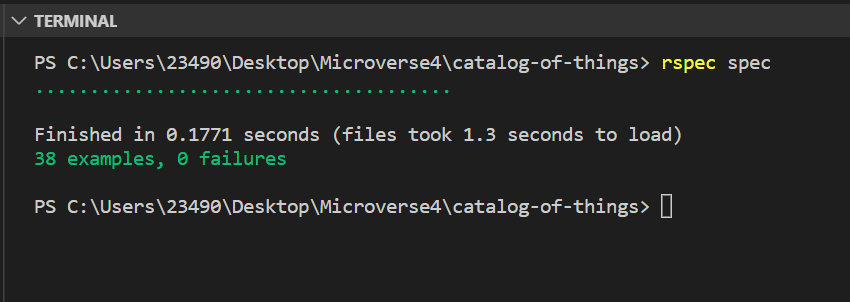

<a name="readme-top"></a>

<div align="center">
  <h1><b> Items Catalog </b></h1>
</div>


## 📗 Table of Contents

- [Catalog Ruby ](#catalog-ruby-)
  - [🛠 Built With ](#-built-with-)
    - [- Tech Stack ](#--tech-stack-)
    - [Key Features ](#key-features-)
  - [💻 Getting Started ](#-getting-started-)
    - [Prerequisites ](#prerequisites-)
    - [Setup ](#setup-)
    - [Installation ](#installation-)
    - [Usage ](#usage-)
    - [Run tests ](#run-tests-)
  - [✍️ Authors ](#️-authors-)
    - [👤 **Chere Lemma**:](#-Chere-Lemma)
    - [👤 **Ismail ALi**:](#-ismail-ali)
    - [👤 **Salomon Tshobohwa**:](#-Salomon-Tshobohwa)
  - [🔭 Future Features ](#-future-features-)
  - [🤝 Contributing ](#-contributing-)
  - [💖 Show your support ](#-show-your-support-)
  - [🙏 Acknowledgments ](#-acknowledgments-)
  - [📝  License ](#--license-)


# Catalog Ruby <a name="about-project"></a>

**Items Catalog** is a console app that will help you to keep a record of different types of things you own: books, music albums, movies, and games. It allow items record to be stored in JSON files and loaded on program stratup.

## 🛠 Built With <a name="built-with"></a>

### - Tech Stack <a name="tech-stack"></a>

<details>
  <summary>Client</summary>
  <ul>
    <li><a href="https://www.ruby-lang.org/en/">Ruby</a></li>
  </ul>
</details>

<details>
<summary>Testing</summary>
  <ul>
    <li><a href="https://rspec.info/">RSpec</a></li>
  </ul>
</details>

<details>
<summary>Linter</summary>
  <ul>
    <li><a href="https://rubocop.org/">Rubocop</a></li>
  </ul>
</details>

### Key Features <a name="key-features"></a>

- Create items like book, music album and game
- List added items
- Preserve each item's data in a separate JSON file
- Load items record from file on start

<p align="right">(<a href="#readme-top">back to top</a>)</p>

### 👨‍💻 Video Documentation  <a name="video-documentation"></a>

 [Project Description Video](#)

<p align="right">(<a href="#readme-top">back to top</a>)</p>

## 💻 Getting Started <a name="getting-started"></a>

To get a local copy up and running, follow these steps.

### Prerequisites <a name="prerequisites"></a>

In order to run this project you need [Ruby](https://www.ruby-lang.org/en/) and [RSpec](https://rspec.info/) installed on your machine.


### Setup <a name="setup"></a>

Clone this repository to your desired folder:

```sh
  git clone https://github.com/Microverse-Fullstack-Program/catalog-of-things.git
```
   cd catalog-of-things

```


### Installation <a name="installation"></a>

Install this project with:

```sh
  bundle install
```

### Usage <a name="usage"></a>

To run the project, execute the following command:

```sh
  ruby main.rb
```

### Run tests <a name="run-tests"></a>

To run tests, run the following command for each test file:

```sh
  cd spec
  rspec classname_spec.rb
```

## Rspec Tests Screenshoot


<p align="right">(<a href="#readme-top">back to top</a>)</p>

## ✍️ Authors <a name="authors"></a>

### 👤 **Chere Lemma**

- GitHub: [@cherelemma](https://github.com/cherelemma)
- LinkedIn: [@chere-lemma27211613](https://www.linkedin.com/in/chere-lemma27211613)
- Twitter: [@twitterhandle](https://twitter.com/Chere21271613)

  
### 👤 **Ismail Changezi**

- GitHub: [@IsmailChangezi](https://github.com/IsmailChangezi)
- LinkedIn: [@ismailchangezi](https://www.linkedin.com/in/ismailchangezi/)
- Twitter: [@IsmailChangezi1](https://twitter.com/IsmailChangezi1)

### 👤 **Salomon Tshobohwa**

- GitHub: [@Tshobohwa](https://github.com/Tshobohwa)
- LinkedIn: [@tshobohwasalomon](https://www.linkedin.com/in/tshobohwasalomon/)
- Twitter: [@SalomonTshoboh1](https://twitter.com/SalomonTshoboh1)


<p align="right">(<a href="#readme-top">back to top</a>)</p>


## 🔭 Future Features <a name="future-features"></a>

- [ ] Update selected Items
- [ ] Add genres/labels/authors
- [ ] Add Items

<p align="right">(<a href="#readme-top">back to top</a>)</p>


## 🤝 Contributing <a name="contributing"></a>

Contributions, issues, and feature requests are welcome!

Feel free to check the [issues page](../../../issues).

<p align="right">(<a href="#readme-top">back to top</a>)</p>


## 💖 Show your support <a name="support"></a>

If you like this project, please consider giving it a 🌟.

<p align="right">(<a href="#readme-top">back to top</a>)</p>


## 🙏 Acknowledgments <a name="acknowledgements"></a>

We would like to thank microverse for serving this opprtunity.


<p align="right">(<a href="#readme-top">back to top</a>)</p>


## 📝  License <a name="license"></a>

This project is [MIT](./LICENSE) licensed.

<p align="right">(<a href="#readme-top">back to top</a>)</p>
